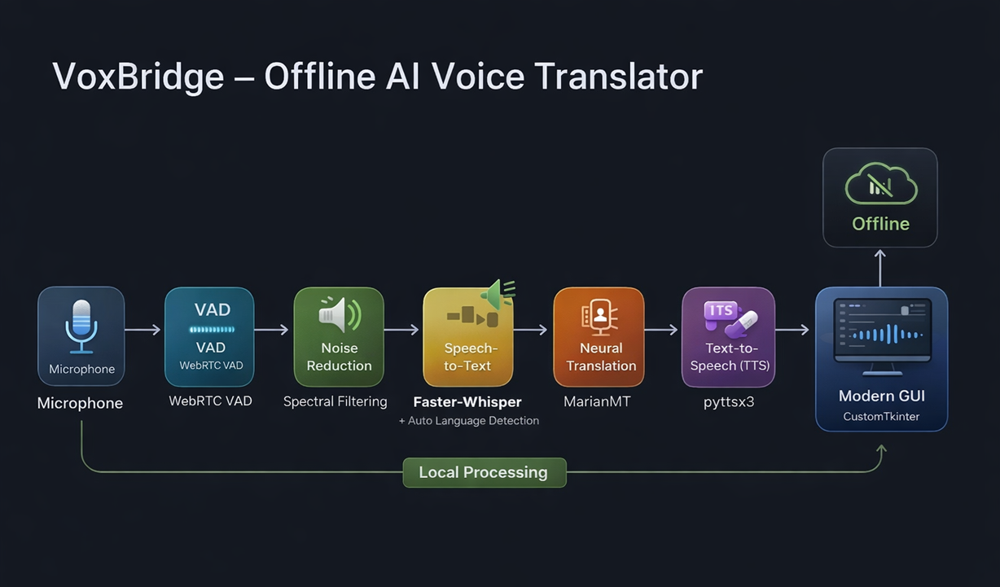
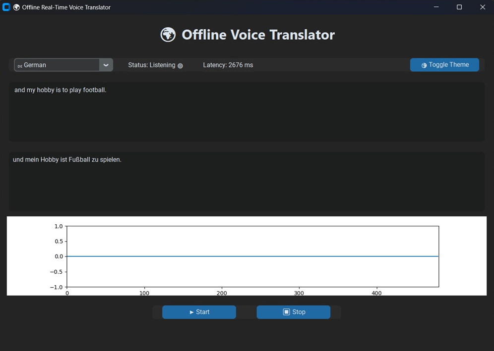
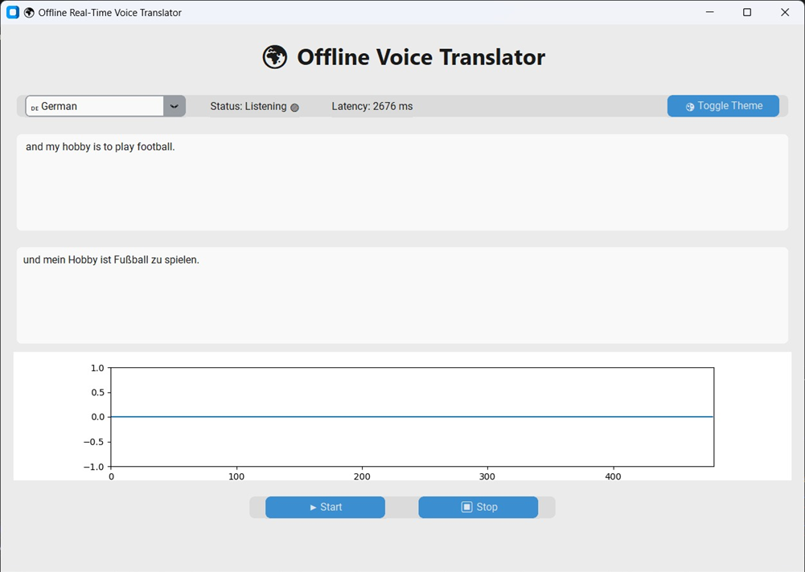

# VoxBridge — Fully Offline AI Voice Translator

VoxBridge is a **fully offline, real-time multilingual AI voice translator** with automatic language detection, silence-aware processing, noise robustness, and a modern graphical user interface.

Unlike cloud-based translators, VoxBridge performs **all inference on-device**, ensuring:

- Complete privacy  
- Low latency  
- No internet dependency  
- Edge-device suitability  

---

# Key Features

- Selectable Target Language (English → Hindi, German, French, etc.)
- Automatic Spoken Language Detection
- Offline Neural Machine Translation
- Silence Detection (Voice Activity Detection)
- Noise Robustness
- Offline Text-to-Speech
- Real-time Latency Display
- Modern GUI (Dark/Light Mode)
- CPU-Based Execution (No GPU required)

---

# System Architecture

Audio Input  
↓  
Voice Activity Detection  
↓  
Noise Reduction  
↓  
Faster-Whisper (Auto Language Detection + STT)  
↓  
MarianMT Transformer (Translation)  
↓  
Offline Text-to-Speech  
↓  
GUI Output  

All processing runs locally. No cloud APIs are used.

### Architecture Diagram



---

# ⚙️ Installation Guide (CRITICAL: Python Version Requirement)

## Python Version Requirement

VoxBridge is tested and verified with:

```
Python 3.11.9
```

⚠️ Python 3.13 is NOT supported due to compatibility issues with:
- faster-whisper
- ctranslate2
- PyTorch builds

Use Python 3.11.x only.

---

# Step 1 — Install Python 3.11.9

Download:

https://www.python.org/downloads/release/python-3119/

During installation:

✔ Add Python to PATH  
✔ Install for all users  

Verify:

```bash
python --version
```

Expected:
```
Python 3.11.9
```

---

# Step 2 — Clone Repository

```bash
git clone https://github.com/tl5275/Voxbridge-offline-ai-translator.git
cd Voxbridge-offline-ai-translator
```

---

# Step 3 — Create Virtual Environment

```bash
python -m venv venv
```

### Windows

Activate:

```bash
venv\Scripts\activate
```

---

### macOS

Activate:

```bash
source venv/bin/activate
```

---

# Step 4 — Install Dependencies

```bash
pip install --upgrade pip
pip install -r requirements.txt
```

---

# Step 5 — Install FFmpeg (Required)

## Windows

1. Download from:
   https://www.gyan.dev/ffmpeg/builds/

2. Extract to:
```
C:\Users\YourName\ffmpeg
```

3. Add:
```
C:\Users\YourName\ffmpeg\bin
```
to System PATH.

Verify:
```bash
ffmpeg -version
```

---

## macOS

Install using Homebrew:

```bash
brew install ffmpeg
```

If Homebrew is not installed:

```bash
/bin/bash -c "$(curl -fsSL https://raw.githubusercontent.com/Homebrew/install/HEAD/install.sh)"
```

Verify:
```bash
ffmpeg -version
```

---

# Step 6 — Run Application

```bash
python main.py
```

---

# Performance Overview

| Stage | Avg Latency |
|--------|------------|
| Speech Recognition | 300–800 ms |
| Translation | 200–400 ms |
| Text-to-Speech | 100–200 ms |
| End-to-End | ~1 second |

Execution Mode: CPU-only  
Internet Required: No  

---

# 🔬 Technical Stack

- Faster-Whisper
- MarianMT
- CTranslate2
- PyAudio
- pyttsx3
- Tkinter
- FFmpeg

---

# Offline vs Cloud Comparison

| Feature | Cloud Systems | VoxBridge |
|----------|---------------|------------|
| Internet Required | Yes | No |
| Data Privacy | Low | High |
| Server Dependency | Yes | No |
| Latency Stability | Network Dependent | Stable |
| Edge Deployment | Limited | Fully Supported |

---

# Energy Efficiency

Cloud-based systems require:
- Network transmission energy
- Remote server inference
- Data center overhead

VoxBridge:
- Eliminates transmission energy
- Performs local CPU inference
- Suitable for edge devices

Estimated CPU draw:
15–25W during active inference.

---

# 🛠 Troubleshooting

If installation fails:

```bash
pip install ctranslate2==4.4.0
pip install faster-whisper==1.0.3
```

If issues persist:

- Ensure Python 3.11 is active
- Delete and recreate virtual environment
- Verify FFmpeg installation

---

# Tested Environment

| Component | Version |
|------------|----------|
| Python | 3.11.9 |
| OS | Windows 11 / macOS |
| CPU | Intel i5 / i7 / Apple Silicon |
| GPU | Not required |
| Mode | Fully Offline |

---

## 🖥 Application Preview

### Dark Mode


### Light Mode


---

# Authors

Tufan Layek  
Protyay Saha  
Rounack Sarkar

SRM Institute of Science and Technology  

---

# License

MIT License

---


**VoxBridge — Bridging Languages Without the Cloud**
